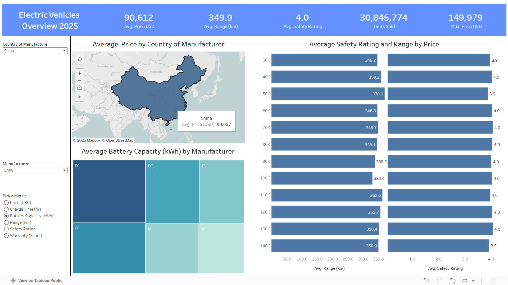

# Electric Vehicles Overview Dashboard 🚗⚡

## 📊 Project Overview
This project analyzes the global Electric Vehicle (EV) market using Tableau.  
It provides insights into average price, range, safety rating, and sales across countries and manufacturers.  

## 🔑 Key Features
- Interactive filters: Country, Manufacturer, and Metric selection.  
- KPIs: Avg. Price, Avg. Range, Safety Rating, Units Sold, Max Price.  
- Visualizations: Maps, Treemaps, and Bar Charts for deep insights.  
- User-focused design for exploring EV market trends.  

## 📂 Files 
- `EV_dashboard.pdf` → Static version of the dashboard.  
- `EV_dashboard.png` → Preview image.  

## 🖼️ Dashboard Preview
  

## 📈 Dashboard
- [View the Dashboard on Tableau Public](https://public.tableau.com/shared/P83FF9SDS?:display_count=n&:origin=viz_share_link)

## 📌 Insights
- Safety ratings remain fairly consistent across price segments.  
- Higher range doesn’t always correlate with higher prices.  
